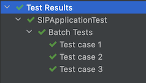

# IKOR SIP Test Kit

[TOC]

# Description

SIP Test Kit is a testing system designed to work with SIP integration adapters. 
It's main purpose is to test how an adapter works internally, by mocking all external communication. 
It executes a test workflow that is defined in a specific file format, 
providing a possibility to create tests without code change. 
This file format is referred to as <i><b>TestCaseDefinition</i></b>. 
The flow itself and thus the TestCaseDefinition file is split into three phases (sections)

- when-execute - The test is executed by triggering one of adapter's endpoints
- with-mocks - External calls which are to be replaced with predefined mock behaviour
- then-expect - The test outcome that should be compared with a predefined expected outcome

# Features

## Response validation

Major feature of Test Kit is validation of the response from test execution.
By adding a validation definition inside the then-expect section
and setting that validation for the endpoint we defined in when-execute section,
the response of the execution will be validated and a report will be displayed.

## External endpoint mocking

This feature is active whenever a test is executed via test kit.
It will provide default behavior (forwarding the request without processing it) and mock all external endpoints.
Adding specific behavior for each endpoint can be done in test case definition in 'with-mocks' section.

## Endpoint reports

Test Kit will provide reports for all mocked endpoints, both with default (set by Test Kit) and user defined behavior.
For each test report in the 'Endpoints' section there will be an overview of request that each received.

## Endpoint validation

It is possible to also validate body and headers of each mocked endpoint.
By defining desired validation inside test case definition file,
Test Kit will validate endpoints and display reports for each.

## Reports

As mentioned each test case will be executed as its own unit test, so for each a test report will be generated
and printed in console.
First part of report is for the response. It will display the validated body and headers, as well as expected ones.
The following endpoints part is for mocked endpoint reports, with similar data as in the first part.

# How to use

Test kit is enabled by default when the adapter is generated from archetype.

A test class needs to be created inside test package of the adapter, which extends SIPBatchTest. 
Running this class would execute the test, but also it will be executed during build time.

```java
public class TFWTest extends SIPBatchTest { }
```

Also, configuring spring profile is needed. Provide the following configuration property inside your test resources.
```yaml
spring:
  profiles:
    active: test
```

The next step is to provide the TestCaseDefinition file in yaml format in the `test/resources` package
(detailed description in next section):
``` yaml
test-case-definitions:
- title: "Title of individual test"
  when-execute:
    endpoint: "id of endpoint under test"
    with:
      body: "Content that will be send as request body to the adapter endpoint (plain text, JSON String)"
      headers:
        header-key: "Value of the header"
        another-header-key: "Another value"
  with-mocks:
  - endpoint: "id of endpoint that should be mocked"
    returning:
      body: "Response message that real endpoint is expected to return"
  then-expect:
  - endpoint: "id of endpoint under test" # matches endpoint under test defined in when phase
    having:
      body: "Regex expression (java) which will be compered to the reponse of the test"
      headers:
        header-key: "Regex expression (java) which will be compered to the value of this header key"
  - endpoint: "id of endpoint that is mocked" # matches endpoint with defined or default mocked behavior
    having:
      body: "Regex expression (java) which will be compered to the request which arrived on the endpoint"
      headers:
        header-key: "Regex expression (java) which will be compered to the header key value from request which arrived on the endpoint"
```

You also need to provide the location of TestCaseDefinition file to the Test Kit by setting the
following property inside adapter configuration:
`sip.testkit.test-cases-path: myTests.yml`
The default value is test-case-definition.yml, so you can place your test case description under that file, 
and skip additional setting.

Each test case will execute as a separate unit test with its own report displayed.



To disable SIP Test Kit, the following configuration is needed:
```yaml
sip:
  testkit:
    enabled: false
```

To be able to fully utilize the Test Kit, all the endpoints used in the test case need to have a defined ID which will be referenced in the _endpoint_ parameter of the test case.


# Defining a Test Case

The TestCaseDefinition file starts with `test-case-definitions` property, which consists of a list of test cases

## when-execute

In this section a request that should be sent to the adapter is defined.

"endpoint" refers to ID (routeId in camel routes) of the endpoint to which we wish to send a test request.
In "with" part we define content of the request we wish to send, meaning body and headers are added here.
The body can also be defined as plain text or JSON string, which represents a POJO.

```yaml
    when-execute:
      endpoint: "rest-endpoint"
      with:
        body: "body of request"
```

## with-mocks

This section contains a list of endpoints for which we wish to have specific mocked behavior.
"endpoint" is the endpoint ID, (processor ID in camel route) of the mocked endpoint.
"returning" should have the body, that we expect as the response from real external call.

```yaml
    with-mocks:
      - endpoint: "external-service"
        returning:
          body: "response message from service"
```

## then-expect

Validation of test response is defined by setting the "endpoint" parameter to the ID of endpoint under test
and defining the expected body or headers.

Also, validation of requests, which mocks received, 
is defined by setting the "endpoint" parameter to the ID of mocked endpoint
and defining the expected body or headers.

Body and header validation is possible by either defining regex (Java) expression or matching exact String content.

```yaml
    then-expect:
      - endpoint: "rest-endpoint" # matches endpoint under test
        having:
          body: "response .* from service"
          headers:
            CamelHttpResponseCode: "200"
      - endpoint: "external-service" # matches endpoint with mocked behavior
        having:
          body: "body of request"
          headers:
            test-mode: "true"
```

# Supported components

Following components support testing with Test Kit:

- REST
- SOAP (by using CXF)
- File
- FTP, FTPS, SFTP

Please check the special conditions for these components in following chapters. since there are some special necessities
which must be met.

### REST

Running Test Kit tests with REST component is straight forward. Keep in mind that REST headers could be provided in 
<i>when-execute</i> phase. There are no special necessities and our general [example](#complete-example) is shown 
with REST component. 

### SOAP

Testing SOAP requests is provided with camel CXF component. When writing body parts within TestCaseDefinition file,
it is required for all three phases (<i>when-execute</i>, <i>with-mocks</i>, <i>then-expect</i>) to provide soap xml
content as a String in one line and to do String escape. Be sure that you meet these requirements, otherwise tests 
could fail.

### File

When testing File component, you provide file content as body in <i>when-execute</i> phase. In real case execution
out of testing, your File component will read actual file from some specified location. In that case exchange within
the route will have File component specific exchange headers (for example `CamelFileName`, `CamelFileLength`, 
`CamelFileLastModified`... ). These headers are listed and explained in Camel File component docs.

If these headers are needed in tests for route processing, they can be provided in <i>when-execute</i> configuration 
part, under <i>headers</i> field. Header keys must be specified exactly the same as they are specified in Camel docs.

When specifying some File headers, we set automatically few other headers which are populated under same conditions and 
calculations as it is done in Camel File component:

1) `CamelFileLength` - calculated and set automatically according to body length.
2) `CamelFileName` - you can provide this header, and we will set `CamelFileNameConsumed` and `CamelFileNameOnly` 
additionally.
3) `CamelFileLastModified` - by providing this header, `CamelMessageTimestamp` will be set additionally.

Any of these benefits and automatically set headers can be overridden by setting the header explicitly.
All other File component headers which are not mentioned here, can be provided by setting them explicitly.

### FTP, FTPS, SFTP

FTP, FTPS and SFTP have same behavior and testing approach in Test Kit. Security differences between them are not
relevant for testing and all three components are equally supported.

FTP component behaves mostly the same as File component. For better understanding, check what are header calculations 
in File component chapter.

On top of File component headers, FTP components have few more headers. However, benefits that we provide in setting 
headers automatically are different, and they are not the same as for File headers:

1) `CamelFileLength` - calculated and set automatically according to body length.
2) `CamelFileAbsolute` - calculated automatically based on component `directoryName` endpoint option.
3) `CamelFileParent` - calculated automatically based on component `directoryName` endpoint option.
4) `CamelFileHost` - calculated automatically based on component `host` endpoint option.
5) `CamelRemoteFileInputStream` - calculated automatically if endpoint option `streamDownload` is set.
6) `CamelFileName` - by providing this header, we set automatically headers `CamelFileNameConsumed`,
`CamelFileNameOnly`, `CamelFileRelativePath`, `CamelFileAbsolutePath` and `CamelFilePath`.
7) `CamelFileLastModified` - by providing this header, `CamelMessageTimestamp` will be set additionally.

Same rules as in File chapter for overriding and providing other headers apply here as well.

# Complete example

**Sample Route**

```java
public class SampleRestRoute extends RouteBuilder {
    public void configure() throws Exception {
        restConfiguration().component("servlet").port("8080").host("localhost");
        
        // Endpoint under test
        from("rest:POST:/say/hello").routeId("rest-endpoint").to("sipmc:bridge");

        from("sipmc:bridge")
                .routeId("http-route")
                // Mocked endpoint
                .to("http:localhost:8081/hello?bridgeEndpoint=true") 
                .id("external-service");
    }
}
```

**Sample test case definition**
``` yaml
  test-case-definitions:
  - title: "Test case 1"
    when-execute:
      endpoint: "rest-endpoint" # id of endpoint under test (routeId)
      with:
        body: "body of request"
    with-mocks:
    - endpoint: "external-service" # id of endpoint that is mocked (processorId)
      returning:
        body: "response message from service"
    then-expect:
    - endpoint: "rest-endpoint" # matches endpoint under test
      having:
        body: "response .* from service"
        headers:
          CamelHttpResponseCode: "200"
    - endpoint: "external-service" # matches endpoint with mocked behavior
      having:
        body: "body of request"
        headers:
          test-mode: "true"
```

**Sample Console Report**

```
-----------------------------
| SIP Test Execution Report |
-----------------------------

    Test "Test case 1" executed successfully.
    Validation details:
      Body validation successful
      Header validation successful
    Actual response:
      Body: response message from service
      Validated headers:
      - CamelHttpResponseCode: 200
    Expected response:
      Body: response .* from service
      Headers:
      - CamelHttpResponseCode: 200
    Endpoints:
      Endpoint "external-service" was mocked
      Validation successful
      Received:
       Body: body of request
       Headers:
        - test-mode: true
      Expected:
       Body: body of request
       Headers:
        - test-mode: true

-----------------------------
```

